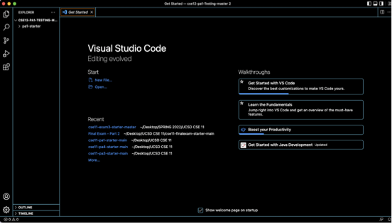

# Lab Report Week 1

```
Step 1:
```

   


For this step, I downloaded Visual Studio Code using the link provided in the write-up. I had it already downloaded previously from another class which did not take long to load up. [https://code.visualstudio.com/]

```
Step 2:
```

  
On this step, I used the command *ssh cs15lfa22zz@ieng6.ucsd.edu* on a new terminal where I got a couple of statements asking if I wanted to continue with the process, in which I agreed, it then asked for my password that connects to my CSE 15L account. After entering the process, I was given the screenshot above showing you how many users are also logging in with the same server and how long the average loading times were. 

```
Step 3: 
```

  
Step 3 was playing around with commands where I spammed a whole bunch of random commands until something was printed showing me a directory. I spammed *cd; cd; cd~; cd ls; ls; ls -a; cd; cd; txt.helloooo; ls -lat; ls; ls; dkf; exit; fka; dkf; cd; cd; c; cd…; cd..*, this lead me to the whole bunch of statements shown in the screenshot. Using the cd command, you can switch directories. The ls command outputs whatever additional information you request with the flags together with the contents of each specified Directory or the name of each specified File. The ls command shows the contents of the current directory if you do not provide a File or Directory.

```
Step 4:
```

  

Step 4 required me to create a file named WhereAmI where I inserted the code provided in the write up and compile it using javac WhereAmI.java then running it using java WhereAmI which gave me what device I was using and what directory I was accessing the file through. I then ran the command *scp WhereAmI.java cs15lfa22zz@ieng6.ucsd.edu:~/* which gave me the statement to give my password and then I ran the command *ssh cs15lfa22zz@ieng6.ucsd.edu* which was a pretty long way of logging in and accessing our account to the server. The scp command transfers data between two remote systems or between a local system and a remote system. This command can be used from either a local system or a remote system. SSH is used by the scp command to transfer data.

```
Step 5:
```

  

Step 5 was using the command ssh-keygen which gave me a bunch of lines of code where I then was asked to use a passphrase which was a shorter version of our password. After reentering the passphrase and entering the file, the terminal printed an image. After exiting, and running the command *ssh cs15lfa22zz@ieng6.ucsd.edu* and *mkdir .ssh* which logged me out so I exited the terminal and started a new one, and ran *scp /Users/joe/.ssh/id_rsa.pubcs15lfa22@ieng6.ucsd.edu:~/.ssh/authorized_keys* with my personal identifications, I was just asked to use my passphrase instead of the long password. This was a very fast version to be able to log in. Step 5 allows us to use a shortcut to access the same files rather than having to input or copy-paste our password each time we run scp or log in, which saves us time. 

```
Step 6:
```


On this and final step of the write up, we were asked to use the command *ssh cs15lfa22zz@ieng6.ucsd.edu" where it asked for our passphrase instead of our password. We were to able to run the commands without having to use our whole password to acess what we needed. It actually saved time knowing all we have to provide in the terminal was our short passphrase. The example I used was "ls" which gave me what file we were using and what was being accessed through Visual Studio Code.
